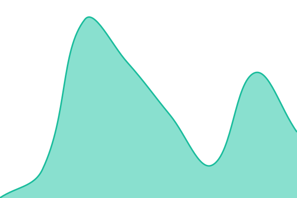
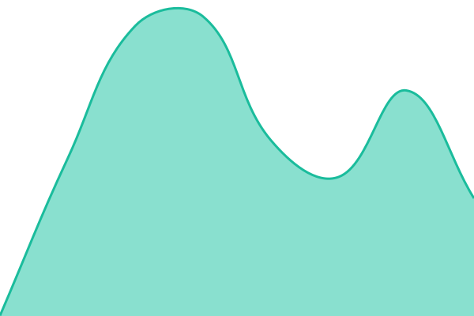
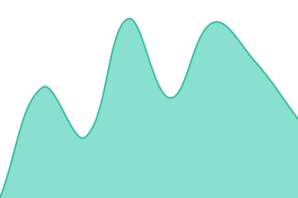

# [📈 Live Status](https://demo.upptime.js.org): <!--live status--> **🟥 Complete outage**

This repository contains the open-source uptime monitor and status page for [Mike Eisemann](https://michaeleisemann.com/), powered by [Upptime](https://github.com/upptime/upptime).

With [Upptime](https://upptime.js.org), you can get your own unlimited and free uptime monitor and status page, powered entirely by a GitHub repository. We use [Issues](https://github.com/androidkitkat/upptime/issues) as incident reports, [Actions](https://github.com/androidkitkat/upptime/actions) as uptime monitors, and [Pages](https://demo.upptime.js.org) for the status page.

<!--start: status pages-->
<!-- This summary is generated by Upptime (https://github.com/upptime/upptime) -->
<!-- Do not edit this manually, your changes will be overwritten -->
<!-- prettier-ignore -->
| URL | Status | History | Response Time | Uptime |
| --- | ------ | ------- | ------------- | ------ |
|  [Matrix](https://matrix.eisemann.us) | 🟥 Down | [matrix.yml](https://github.com/AndroidKitKat/upptime/commits/HEAD/history/matrix.yml) | 

 465ms
     
 | 

<a href="https://status.michaeleisemann.com/history/matrix">99.77%</a>
    

|  [Yld.Moe](https://yld.moe) | 🟥 Down | [yld-moe.yml](https://github.com/AndroidKitKat/upptime/commits/HEAD/history/yld-moe.yml) | 

 8062ms
     
 | 

<a href="https://status.michaeleisemann.com/history/yld-moe">97.75%</a>
    

|  [Personal Site](https://michaeleisemann.com) | 🟥 Down | [personal-site.yml](https://github.com/AndroidKitKat/upptime/commits/HEAD/history/personal-site.yml) | 

 326ms
     
 | 

<a href="https://status.michaeleisemann.com/history/personal-site">99.84%</a>
    

|  [Gitea](https://code.michaeleisemann.com) | 🟥 Down | [gitea.yml](https://github.com/AndroidKitKat/upptime/commits/HEAD/history/gitea.yml) | 

 603ms
     
 | 

<a href="https://status.michaeleisemann.com/history/gitea">99.89%</a>
    

|  [ZNC](https://znc.waifupaste.moe:42069) | 🟥 Down | [znc.yml](https://github.com/AndroidKitKat/upptime/commits/HEAD/history/znc.yml) | 

 262ms
     
 | 

<a href="https://status.michaeleisemann.com/history/znc">97.94%</a>
    

|  [Music](https://music.graped.net) | 🟥 Down | [music.yml](https://github.com/AndroidKitKat/upptime/commits/HEAD/history/music.yml) | 

 3220ms
     
 | 

<a href="https://status.michaeleisemann.com/history/music">0.00%</a>
    

|  [HOA](https://severnpineshoa.com) | 🟥 Down | [hoa.yml](https://github.com/AndroidKitKat/upptime/commits/HEAD/history/hoa.yml) | 

 824ms
     
 | 

<a href="https://status.michaeleisemann.com/history/hoa">99.99%</a>
    

|  [HOA Cloud](https://cloud.severnpineshoa.com/) | 🟥 Down | [hoa-cloud.yml](https://github.com/AndroidKitKat/upptime/commits/HEAD/history/hoa-cloud.yml) | 

 968ms
     
 | 

<a href="https://status.michaeleisemann.com/history/hoa-cloud">100.00%</a>
    

<!--end: status pages-->

[**Visit our status website →**](https://demo.upptime.js.org)

## 📄 License

- Powered by: [Upptime](https://github.com/upptime/upptime)
- Code: [MIT](./LICENSE) © [Anand Chowdhary](https://anandchowdhary.com), supported by [Pabio](https://pabio.com)
- Data in the `./history` directory: [Open Database License](https://opendatacommons.org/licenses/odbl/1-0/)
